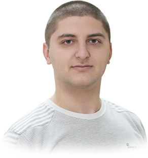

<h1>I am Ivan Dokov</h1>

Web developer since 2006. 

::: center-50

:::

I love writing code, playing with Linux servers and trying the newest technologies. 
My passion to web development made my favourite hobby a full time job. I've been a team leader in several companies and now I lead my own web development company called

::: center-50

:::

---

## Tech Experience

Through the years I've tried many technologies and I learned a lot of useful (and not that much) things. if I have to make a list of all the things I use(d) or interacted with it will look like this. The order is not important.

* HTML, CSS, SCSS, LESS, CSS/SVG Animations 
* JavaScript, TypeScript, Dart
* PHP, Laravel, Slim, CodeIgniter, WordPress
* Node.js, Express, socket.io
* Angular, Vue, React, jQuery, Leaflet
* [Rockety](https://github.com/ivandokov/rockety), Laravel Mix, Webpack, Babel, Gulp, Grunt
* MySQL, Redis, [Depy](https://github.com/ivandokov/depy), Python
* DigitalOcean, Amazon EC2, Amazon S3, PHP-FPM, Nginx, Apache
* Stripe, Braintree, PayPal, Borica payments
* Bash, Git, SVN, Vagrant
* Photoshop, Illustrator, Lightroom, Sketch, Zeplin, SketchUp, AutoCAD
* ... and I probably forgot a lot more.

## Education

I graduated as Geodesy Engineer with Master's Degree from [Univercity of Architecture Civil Engineering and Geodesy](https://www.uacg.bg/) - Sofia, Bulgaria.

## Employment

I used to work for companies such as [Shtrak](http://shtrak.bg/), [Cloud Cart](http://cloudcart.com/), [DtailStudio](http://www.dtailstudio.com/) and others.  
Now I work for myself at [JetSpark](http://jetspark.io).

## Hobbies

I am passionate about mutiple activities in my life but the top place is taken by my spearfishing hobby.

### Spearfishing :fish:

I may have to present my spearfishing activities not only as hobby as I am competing prefessionally since 2016 and I first held a speargun underwater when I was just 8 years old.

### Photography :camera:

I consider myself an advanced amateur in this area. You can take a look at my [portfolio](https://500px.com/ivandokov).

### Playing guitar :guitar:

I am listening to rock and metal music basically my entire life. During my professional career I had several colleagues which are also professional guitar players and they ignited this spark by accident. At the moment I suck but I'm trying...

### Table tennis :ping_pong:

I used to be pretty good player but my daily routine (or my laziness or lack of time) is stopping me from playing these days.

### Gaming :video_game:

I have a long history with [Lineage II](https://www.lineage2.com/). This is my favourite game ever and I still have hard time breaking up with it. I started playing when I was 15 years old. Before that I was mostly playing Counter-Strike, WarCraft III and Diablo II.