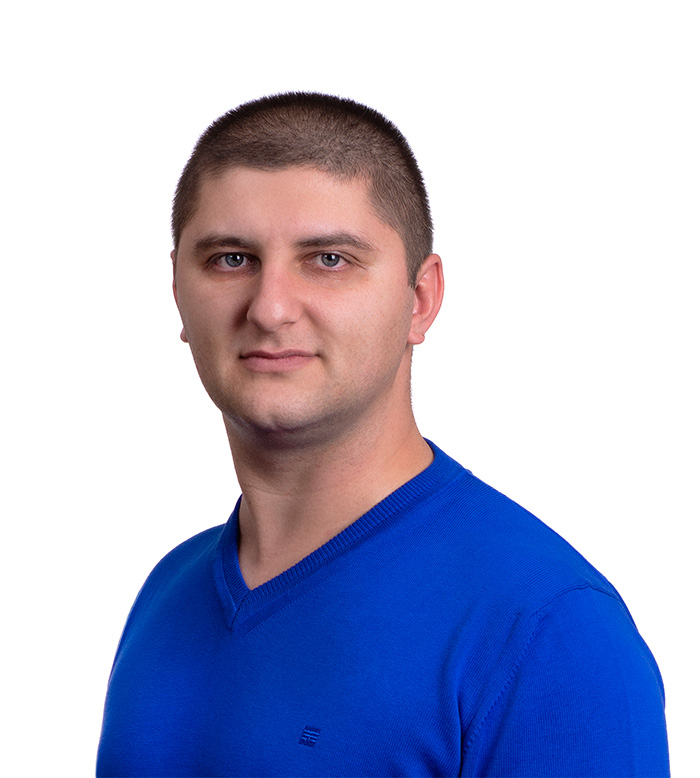

::: center
<h1>I am Ivan Dokov</h1>

My web related experience dates back to 2006  
when I developed my first website for a client.

:::

::: center-50

:::

I love writing code, playing with Linux servers and trying new technologies. 
My passion to web development made my favourite hobby a full time job. I was a team leader and coach in multiple
companies, and now I work as a web consultant and developer at my own company
called .

## Tech Experience

Through the years I've tried many technologies and I learned a lot of things. I enjoy equally working on frontend as I
do on backend. If I have to
make a list of all the things I use or interacted with it will look like this.

### Current tech stack

* PHP, Laravel, Laravel Livewire, AlpineJS, TailwindCSS
* MySQL, Redis, Nginx, DigitalOcean

### I also have experience with the following

* Vue, Angular, React, Vuepress, Leaflet
* Docker, Ansible, [Depy](https://github.com/ivandokov/depy)
* Slim, CodeIgniter, WordPress
* Shopify themes development
* Node.js, Express, socket.io, Python
* Webpack, Laravel Mix, Babel, Gulp, Grunt
* Amazon EC2, Amazon S3, Apache
* Stripe, Braintree, PayPal, Borica payments
* Bash, Dart, Go
* Git, SVN, Vagrant
* Photoshop, Illustrator, Lightroom, Figma, Sketch, Zeplin, SketchUp, AutoCAD

## Employment

I used to work for companies such
as [DtailStudio](http://www.dtailstudio.com/), [Cloud Cart](http://cloudcart.com/), [Shtrak](http://shtrak.bg/) and
others. Everywhere I worked I influenced a positive change in the dev teams by improving the processes either as a team
lead or helping my colleagues developers to use better practices I've learned from my experience.  
Now I work for myself at [JetSpark](https://jetspark.io/?utm_source=dokov.bg&utm_medium=about).

Some of my clients:

* [CCIRC](http://immigration.ca/) - The largest immigration company in Canada. I've developed multiple internal
  systems (currently 3)
  for them. Basically my software runs most of their business.
* [MobilAds](https://www.mobilads.co/) - Advertising platform. Drivers earn money by placing ads on their cars and
  companies get amazing ROI by displaying high impact ads in large cities. I've developed the main website and the blog
  system.
* [AlphaFoods](https://alphafoods.de/) - Healthy food supplements in Germany. I've developed the Shopify theme.
* [Discology](https://discology.io/) - A silent disco platform. For people to create space for themselves and others to
  meet and connect. I've developed the whole web app.
* [BloomFile](https://bloomfile.com/) - On-demand Real
  Estate Assistance. I've developed the marketing site, blog and the web app.
* [Window Well Experts](https://windowwellexperts.com/) - One of the largest manufacturers of window wells in the USA.
  I've developed their main software - the quotes collection software which is due to v2 upgrade with payments
  processing capabilities.
* [RockDiving](https://rockdiving.bg/en) - Diving center in Bulgaria
* [Activ](https://activ.bg/) - Largest auditing and accounting company in Bulgaria. I've developed the website and
  administrative panel with built-from-scratch WYSIWYG page builder.
* [LR Health & Beauty](https://www.lrworld.com/) - Health & Beauty products. I've developed an event announcement page
  with live chat and video streaming.

## Education

I graduated as Geodesy Engineer with Master's Degree
from [Univercity of Architecture Civil Engineering and Geodesy](https://www.uacg.bg/) - Sofia, Bulgaria.

## Hobbies

I am passionate about multiple activities in my life but the top place is taken by my spearfishing hobby.

### Spearfishing :fish:

I may have to present my spearfishing activities not only as hobby as I am competing professionally since 2016, and I
first held a speargun underwater when I was just 8 years old.

### Photography :camera:

I like taking photos and I think I'm a step above an amateur. Unfortunately I don't have enough time to enjoy it and
my [portfolio](https://500px.com/ivandokov) is rather empty.

### Playing guitar :guitar:

I am listening to rock and metal music basically my entire life. During my professional career I had several colleagues
which are professional guitar players, and they ignited this spark by accident. At the moment I suck, but I'm
trying...

### Table tennis :ping_pong:

I used to be pretty good player, but I hardly find any time to play anymore.

### Gaming :video_game:

I have a long history with [Lineage II](https://www.lineage2.com/). This is my favourite game ever and I still play from
time to time. I started playing when I was 15. Before that I was mostly playing Counter-Strike, Diablo II and some
WarCraft III.
