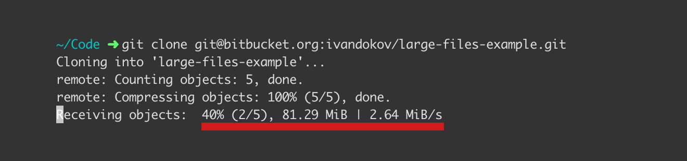

# Git Extras



It is not a rare case to unintentionally add large files to the git history. A misconfigured `.gitignore` file or a team member relying on global `.gitignore` assuming everyone in the team has the same ignore rules... It could happen. And what we do once it happens? We need a way to find large files in our repository. I made a collection of scripts that I found online and use in such cases. I called it [Git Extras](https://github.com/ivandokov/git-extras). 

## Git Large Files

[`git-large-files`](https://github.com/ivandokov/git-extras/blob/master/git-large-files) is a small script that gives you the ability to find files larger than *N* megabytes in a git repository. It scans the whole history and prints our large files. You can use it like this to find files larget than 2MB:

```bash
./git-large-files 2
```

The output is similar to this:

```
281218048 95f938800a72eef017cf41d1945ac1a83e03285e path/to/file.avi
```

It shows the size in bytes, the commit that added the file to the history and the path to the file.

Once we have the paths to the large files we can use [`git-remove-history`](https://github.com/ivandokov/git-extras/blob/master/git-remove-history).

## Git Remove History

[`git-remove-history`](https://github.com/ivandokov/git-extras/blob/master/git-remove-history) rewrites the git history and removes the provided files. You can use it like this:

```bash
./git-delete-history path1 path2
```

When you rewrite the history of a git repository you have to use `git push --force` to upload the rewritten repository to the server.  

**WARNING** Force push is operation that you **cannot** reverse. If someone uploads newer code than what you have locally it will be lost!  