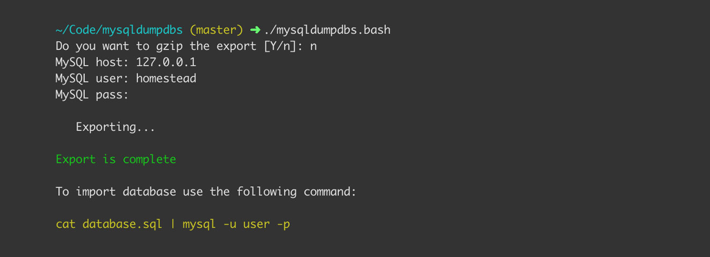
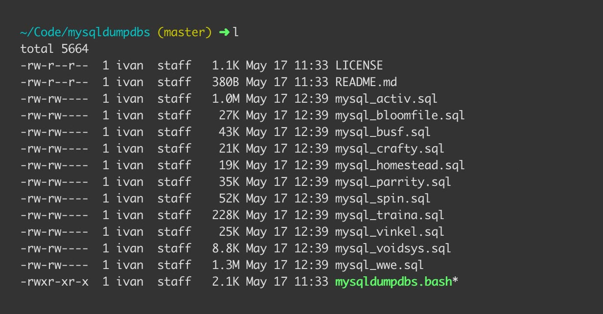

# MySQL Dump Databases



Sometimes you may need to export all databases from a MySQL server but each database to be in a separate file.
You can easily do this with a few lines of code but why should you remember how to do it every time?
Well since I do not want to remember it I created a small script called [mysqldumpdbs](https://github.com/ivandokov/mysqldumpdbs) that does that. Dump all MySQL databases from a server in separate files.

You simply have to run the script `./mysqldumpdbs.bash`.
It will ask you the following questions:

```bash
Do you want to gzip the export [Y/n]: 
MySQL host: 
MySQL user: 
MySQL pass:
```

Once the information is provided you will have all databases exporeted in separate files and optionally gzipped.
Also you will see a message of how to import them easily. Again you don't have to Google it every time. The tool says what you should do. 




## Shortcuts

I thought you may not want to clone the repository locally and will want to run the script with a single command so I created shortcut link to the script and with the following commands you can directly execute it in your terminal.

### wget
```bash
bash <(wget -qO- http://git.io/vvyfd)
```

### curl
```bash
bash <(curl -sL http://git.io/vvyfd)
```
